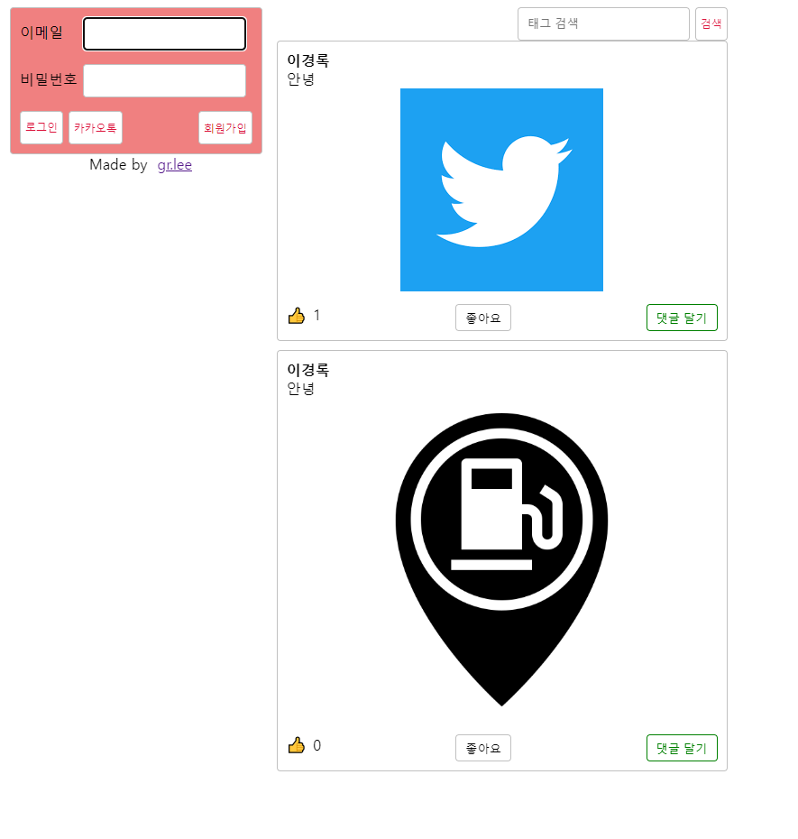
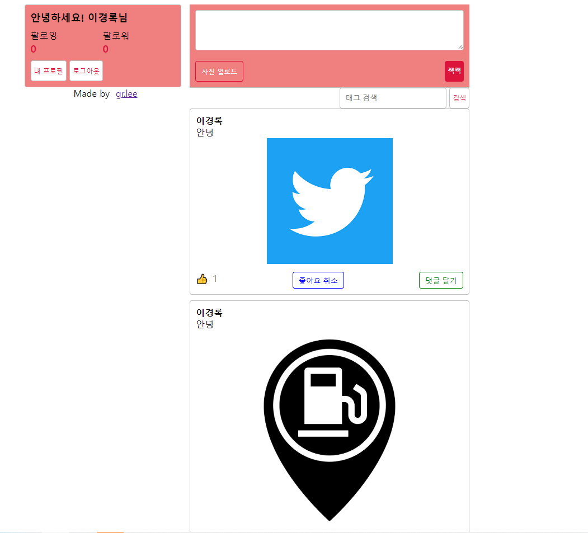

#FuelFinde

<h2> Node sns</h2>
ORM을 사용하여 간단한 SNS기능을 가진 웹페이지를 구현했습니다. 🍀

## 목차
  - [개요](#개요) 
  - [설명](#설명)

## 개요
- 프로젝트 이름: Node sns
- 프로젝트 지속기간: 2023.12-2024.01
- 개발 엔진 및 언어: Next.js && node.js
- 멤버: 이경록

## 설명
|||
|:---:|:---:|
|로그인 전 메인화면|로그인 후 메인화면|

- 로그인 전 메인화면  
사용자는 일반 로그인, 카카오 로그인으로 접속하며 유저는 세션으로 관리됩니다.  로그인 이전에는 검색기능만 사용 가능합니다.
- 로그인 후 메인화면 
사용자는 좋아요, 좋아요 취소, 검색, 이미지 및 글 업로드를 할 수 있습니다.   사용자는 팔로잉 목록, 팔로우 목록을 확인할 수 있고, 닉네임 또한 변경이 가능합니다.